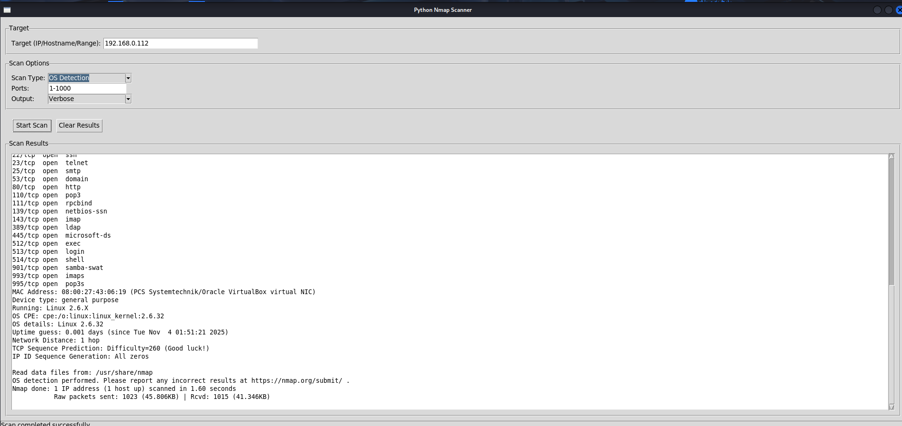

# ⚡ Python Nmap GUI Scanner

A user-friendly **Python-based GUI for Nmap** that allows you to perform fast and advanced network scans directly from an interactive desktop interface.  
Built with **Tkinter**, this tool provides multiple scan types, live progress updates, and formatted results — no terminal needed.

## 🚀 Features

- 🖥️ Simple Tkinter GUI — no need for CLI commands
- ⚙️ Supports multiple scan modes:
  - Quick Scan (fast top 1000 ports)
  - Full Scan (1–65535 ports)
  - Ping Scan (host discovery)
  - OS Detection
  - Version Detection
  - Custom scans with manual port ranges
- 📊 Real-time scan output with scrollable text view
- 🧩 Compatible with Windows, Linux, and macOS
- 🔄 Multi-threaded execution keeps GUI responsive
- 🧠 Smart Nmap command builder based on user input

##Screenshots
## 🖼️ Screenshots

<p align="center">
  
</p>

<p align="center">
  
</p>


## 🛠️ Installation Guide (Kali linux)
 ```bash
sudo apt update && sudo apt upgrade -y
sudo apt install python3 python3-pip python3-tk nmap git -y
git clone https://github.com/sam_rat/Network_scanner.git
cd Network_scanner
pip3 install -r requirements.txt
sudo python3 Network_scanner.py

